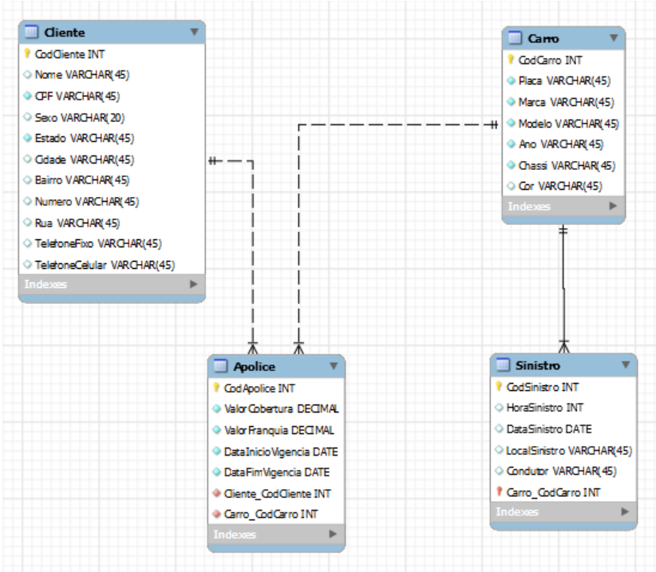

# Banco de dados: criação de tabelas (modelo físico)

### 💡 Visão Geral 
- O trabalho foi escrito com a utilização dos comandos DDL(Data Definition Language) - Create, Alter, Drop - para a implementação de quatro tabelas e inserir restrições de tipo e valores de dados, utilizando o SQL Server.  

- A atividade teve como objetivo exercitar os conceitos trabalhados na disciplina de Banco de Dados - Relacional, administrada pelo professor [Mateus Guilherme Fuini](https://br.linkedin.com/in/mateusfuini) na instituição [FATEC Itapira](https://fatecitapira.edu.br/).



## Contexto do exercício

### Tabela Cliente

Contém informações sobre os clientes da seguradora. Identificador exclusivo para CodCliente, tornando-o uma chave primária(PK) e, consequentemente, diferenciando cada cliente cadastrado. A tabela deve ter as colunas Nome, CPF, Sexo, Estado, Cidade, Bairro, Numero, Rua, TelefoneFixo e TelefoneCelular para armazenar informações pessoais e de contato dos clientes. As colunas possuem restrições[^cliente], como a coluna Nome que não pode ser nula (NOT NULL), e as colunas CPF e TelefoneCelular que devem ser únicas (UNIQUE). A coluna Cidade possui um valor padrão definido como 'Itapira', ou seja, caso a informação não seja fornecida, esse será o valor padrão atribuído.

```sql
-- Cliente:
CREATE TABLE Cliente
CodCliente INT
Nome VARCHAR(45)
CPF VARCHAR(45)
Sexo VARCHAR(20)
Estado VARCHAR(45)
Cidade VARCHAR(45)
Bairro VARCHAR(45)
Numero VARCHAR(45)
Rua VARCHAR(45)
TelefoneFixo VARCHAR(45)
TelefoneCelular VARCHAR(45)
```

### Tabela Carro

Contém informações sobre os carros da seguradora. Identificador exclusivo para CodCliente, tornando-o uma PK. A tabela deve conter as colunas Placa, Marca, Modelo, Ano, Chassi e Cor. Todas as colunas devem possuir a restrição[^carro] de serem obrigatórias, menos a coluna Cor.

```sql
-- Carro:
CREATE TABLE Carro
CodCarro INT
Placa VARCHAR(45) 
Marca VARCHAR(45) 
Modelo VARCHAR(45) 
Ano VARCHAR(45) 
Chassi VARCHAR(45) 
Cor VARCHAR(45)
```

### Tabela Apólice

Armazena informações sobre as apólices de seguro dos clientes. CodApolice possui um identificador exclusivo. A Tabela deve possuir as colunas ValorCobertura, ValorFranquia, DataInicioVigencia, DataFimVigencia, Cliente_CodCliente e Carro_CodCarro. As colunas Cliente_CodCliente e Carro_CodCarro possuem restrições[^apolice] de chaves estrangeiras que se relacionam com a tabela Cliente e Carro, respectivamente. E todas colunas devem ser obrigatórias.

```sql
-- Apolice
CREATE TABLE Apolice
CodApolice INT
ValorCobertura DECIMAL 
ValorFranquia DECIMAL
DataInicioVigencia DATE
DataFimVigencia DATE
Cliente_CodCliente INT
Carro_CodCarro INT
```

### Tabela Sinistro

Armazena informações sobre os sinistros envolvendo os carros dos clientes.  CodSinistro e Carro_CodCarro serão chaves compostas. A tabela deve possuir as colunas como HoraSinistro, DataSinistro, LocalSinistro e Condutor que armazenam informações sobre o horário, data, local, condutor e qual carro está envolvido em cada sinistro. A coluna Carro_CodCarro possui uma restrição[^sinistro] de chave estrangeira que se relaciona com a tabela Carro.

```sql
-- Sinistro:
CREATE TABLE Sinistro
CodSinistro INT
HoraSinistro INT
DataSinistro DATE
LocalSinistro VARCHAR(45)
Condutor VARCHAR(45)
Carro_CodCarro INT
```

### RESTRIÇÕES

[^cliente]: Tabela Clientes

```sql
Chave Primária: CodCliente

Colunas obrigatórias: Nome, CPF, TelefoneCelular

Colunas Únicas: CPF, TelefoneCelular

Coluna com valor padrão: Cidade – Valor Padrão ‘Itapira’
```

[^carro]: Tabela Carro

```sql
Chave Primária: CodCarro

Colunas obrigatórias: Placa, Marca, Modelo, Ano e Chassi
```

[^apolice]: Tabela Apólice

```sql
Chave Primária: CodApolice

Chave Estrangeira: Cliente_CodCliente, Carro_CodCarro

Colunas Obrigatórias: Todas

Coluna com checagem: DataInicioVigencia (maior que a data atual)
```

[^sinistro]: Tabela Sinistro:

```sql
Chave Primária Composta: CodSinistro, Carro_CodCarro

Chave Estrangeira: Carro_CodCarro
```